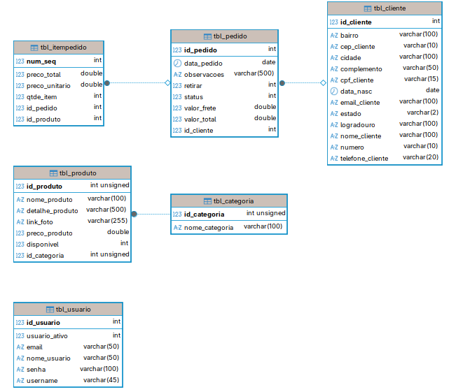

# Especificações do Projeto

Pré-requisitos: <a href="01-Documentação de Contexto.md"> Documentação de Contexto</a>

## Arquitetura e Tecnologias

A solução segue o padrão de **API RESTful** com arquitetura em camadas, garantindo desacoplamento entre as regras de negócio e a interface do usuário.

* **Linguagem:** Java 17
* **Framework:** Spring Boot 3
* **Persistência:** Spring Data JPA / MySQL 8
* **Dependências:** Maven
* **Segurança:** Spring Security + JWT

## Requisitos do Sistema

### Requisitos Funcionais (RF)

| ID     | Descrição do Requisito                                                                 | Prioridade |
| ------ | -------------------------------------------------------------------------------------- | ---------- |
| RF-001 | **Catálogo de Produtos:** Listar produtos com paginação, filtro por categoria e busca. | ALTA       |
| RF-002 | **Carrinho de Compras:** Adicionar/Remover itens e calcular totais dinamicamente.      | ALTA       |
| RF-003 | **Cálculo de Frete:** Calcular taxa de entrega baseada na faixa de CEP do cliente.     | ALTA       |
| RF-004 | **Checkout:** Coletar dados do cliente, endereço e finalizar o pedido.                 | ALTA       |
| RF-005 | **Notificação Telegram:** Enviar alerta ao ADM via Bot quando um pedido for realizado. | MÉDIA      |
| RF-006 | **Gestão Financeira:** Gerar registros de "Contas a Receber" ao finalizar pedido.      | BAIXA      |
| RF-007 | **Integração WhatsApp:** Permitir agendamento direto via link do WhatsApp na vitrine.  | MÉDIA      |

### Requisitos Não Funcionais (RNF)

| ID      | Descrição do Requisito                                                                   | Prioridade |
| ------- | ------------------------------------------------------------------------------------ | ---------- |
| RNF-001 | **Segurança:** As senhas dos usuários devem ser criptografadas no banco.             | ALTA       |
| RNF-002 | **Performance:** A listagem de serviços deve carregar em menos de 2 segundos.        | MÉDIA      |
| RNF-003 | **Responsividade:** O sistema (Front-end) deve funcionar perfeitamente em celulares. | ALTA       |

## Arquitetura de Segurança

A API utiliza o padrão **Stateless** com **JWT (JSON Web Token)**. Não há sessão no servidor; a autenticação é validada a cada requisição via cabeçalho HTTP.

### Fluxo de Autenticação:
1.  **Login:** O cliente envia `usuario` e `senha`. Se válido, a API retorna um Token JWT assinado contendo ID, Nome e Email (Claims).
2.  **Acesso:** Para acessar rotas protegidas (ex: `/pedidos`), o cliente deve enviar o cabeçalho: `Authorization: Bearer <TOKEN>`.

## Modelo de Dados (Em Evolução)

### Tabela: `tbl_usuario`
Responsável pelo controle de acesso (Login/Senha) e perfil administrativo.

| Campo           | Tipo         | Detalhes                      |
| --------------- | ------------ | ----------------------------- |
| id_usuario      | INT          | PK, Auto Increment            |
| nome_usuario    | VARCHAR(50)  | Nome de exibição              |
| email           | VARCHAR(50)  | Unique, Not Null              |
| username        | VARCHAR(45)  | Unique (Login do Sistema)     |
| senha           | VARCHAR(100) | Hash criptografado (BCrypt)   |
| usuario_ativo   | INT          | 1 (Ativo) / 0 (Inativo)       |

### Tabela: `tbl_categoria`
Responsável por agrupar os tipos de serviços.

| Campo           | Tipo          | Detalhes                      |
| --------------- | ------------- | ----------------------------- |
| id_categoria    | INT           | PK, Auto Increment            |
| nome_categoria  | VARCHAR(100)  | Unique, Not Null              |

### Tabela: `tbl_produto`
Armazena tanto serviços (mão de obra) quanto produtos físicos.

| Campo             | Tipo         | Detalhes                                      |
| ----------------- | ------------ | --------------------------------------------- |
| id_produto        | INT (PK)     | Identificador único                           |
| nome_produto      | VARCHAR(100) | Nome do serviço ou produto                    |
| detalhe_produto   | TEXT         | Descrição técnica                             |
| link_foto         | VARCHAR(255) | URL/Caminho da imagem                         |
| preco_produto     | DOUBLE       | Preço padrão (De)                             |
| preco_promocional | DOUBLE       | Preço de venda (Por)                          |
| disponivel        | INT          | 1=Visível, 0=Oculto                           |
| destaque          | INT          | 1=Aparece na Home, 0=Apenas na busca          |
| pronta_entrega    | INT          | 1=Exibe selo "Pronta Entrega"                 |
| id_categoria      | INT (FK)     | Referência à `tbl_categoria`                  |

### Tabela: `tbl_cliente`
Armazena os dados dos clientes do Lava-Jato.

| Campo            | Tipo         | Detalhes                      |
| ---------------- | ------------ | ----------------------------- |
| id_cliente       | INT          | PK, Auto Increment            |
| nome_cliente     | VARCHAR(100) | Not Null                      |
| email_cliente    | VARCHAR(100) | Unique, Not Null              |
| telefone_cliente | VARCHAR(20)  | Unique, Not Null              |
| cpf_cliente      | VARCHAR(15)  | Opcional                      |
| data_nasc        | DATE         | Opcional                      |
| cep_cliente      | VARCHAR(10)  | Endereço                      |
| logradouro       | VARCHAR(100) | Endereço                      |
| cidade           | VARCHAR(100) | Endereço                      |
| estado           | VARCHAR(2)   | Endereço                      |

### Tabela: `tbl_pedido`
Registra os cabeçalhos dos pedidos realizados.

| Campo             | Tipo         | Detalhes                                      |
| ----------------- | ------------ | --------------------------------------------- |
| id_pedido         | INT (PK)     | Identificador único                           |
| data_pedido       | DATE         | Data da realização                            |
| valor_total       | DOUBLE       | Soma dos itens + Frete                        |
| valor_frete       | DOUBLE       | Valor do frete aplicado                       |
| retirar           | INT          | 1=Retirada, 0=Delivery                        |
| status            | INT          | 1=Novo, 2=Pago, 3=Transporte, 4=Entregue...   |
| observacoes       | TEXT         | Notas do cliente                              |
| id_cliente        | INT (FK)     | Referência à `tbl_cliente`                    |

### Tabela: `tbl_itempedido`
Tabela associativa que armazena os produtos de cada pedido.

| Campo          | Tipo   | Detalhes                                |
| -------------- | ------ | --------------------------------------- |
| num_seq        | INT    | PK, Auto Increment                      |
| qtde_item      | INT    | Quantidade solicitada                   |
| preco_unitario | DOUBLE | Preço do produto no momento da compra   |
| preco_total    | DOUBLE | (Qtde * Unitario) com possível desconto |
| id_pedido      | INT    | FK (Ref. tbl_pedido)                    |
| id_produto     | INT    | FK (Ref. tbl_produto)                   |

### Tabela: `tbl_financeiro`
Responsável pelo fluxo de caixa e parcelamento.
| Campo             | Tipo         | Detalhes                                      |
| ----------------- | ------------ | --------------------------------------------- |
| num_seq           | INT (PK)     | Identificador                                 |
| num_parcela       | INT          | Número da parcela (ex: 1 de 3)                |
| total_parcelas    | INT          | Total de parcelas                             |
| vencimento        | DATE         | Data de vencimento prevista                   |
| valor_bruto       | DOUBLE       | Valor original                                |
| valor_liquido     | DOUBLE       | Valor após taxas                              |
| id_pedido         | INT (FK)     | Origem da receita                             |
| forma_pgto        | INT (FK)     | Referência à `tbl_formapgto`                  |

### Tabela: `tbl_frete`
| Campo             | Tipo         | Detalhes                                      |
| ----------------- | ------------ | --------------------------------------------- |
| id                | INT (PK)     | Identificador                                 |
| prefixo           | VARCHAR(10)  | Faixa de CEP (ex: "66000")                    |
| valor             | DOUBLE       | Custo da entrega para esta faixa              |
| descricao         | VARCHAR(100) | Nome da região (ex: "Centro", "Icoaraci")     |

### Tabela: `tbl_formapgto`
| Campo             | Tipo         | Detalhes                                      |
| ----------------- | ------------ | --------------------------------------------- |
| num_seq           | INT (PK)     | Identificador                                 |
| descricao         | VARCHAR(40)  | Ex: "Cartão Crédito", "Pix"                   |
| retencao          | DOUBLE       | Taxa da operadora (%) para cálculo líquido    |

### Diagrama Entidade-Relacionamento (DER)

## Restrições

| ID | Restrição                                             |
|----|-------------------------------------------------------|
| 01 | O projeto deve ser capaz de rodar em containers Docker|
| 02 | O sistema deve priorizar experiência Mobile (Responsivo)|
