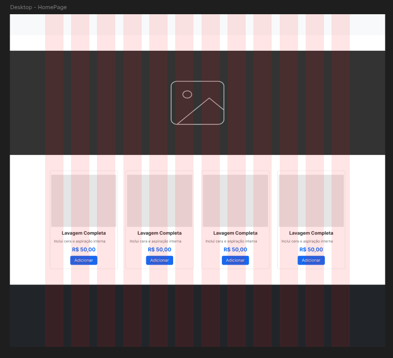
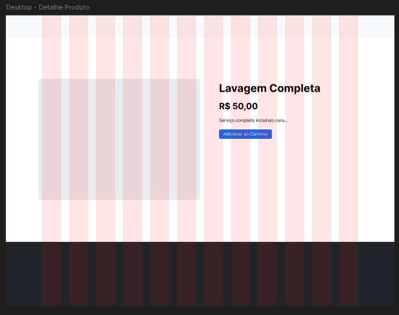

# Projeto de Interface

Pré-requisitos: <a href="02-Especificação do Projeto.md"> Especificação do Projeto</a>

## Fluxo de Usuário (User Flow)

O fluxo principal foca na experiência do cliente final, garantindo que ele possa encontrar e contratar serviços com o mínimo de cliques.

1.  **Home (Vitrine):** O cliente visualiza todos os serviços disponíveis.
2.  **Detalhes:** Ao clicar em um serviço, ele vê informações técnicas, preço e foto ampliada.
3.  **Ação:** O cliente decide entre "Adicionar ao Carrinho" ou "Agendar via WhatsApp".

## Telas Implementadas (Front-end v1.0)

A interface foi desenvolvida utilizando **Angular 19** com **Bootstrap 5**, garantindo responsividade e um design limpo e profissional.

### 1. Tela Inicial (Vitrine de Serviços)
A Home apresenta os serviços em um **Grid Responsivo**. Cada "Card" contém a foto do serviço, nome, breve descrição e preço. O layout utiliza um sistema de colunas que se adapta a celulares e desktops.

*(Captura de tela da versão Desktop - 11/02/2026)*

### 2. Tela de Detalhes do Produto
Ao selecionar um serviço, o cliente é direcionado para uma rota específica (ex: `/detalhe/1`). Nesta tela, a imagem ganha destaque e as ações de conversão ("Agendar" ou "Comprar") são enfatizadas.

*(Captura de tela da versão Desktop - 11/02/2026)*

## Identidade Visual e Layout
O projeto utiliza uma paleta de cores escura/industrial, alinhada ao segmento automotivo, com destaque em **Amarelo (#FFC107)** para ações de conversão (Botões, Preços, Badges).

### 1. Home (Vitrine de Destaques)
A página inicial utiliza um carrossel rotativo para promoções, seguido por uma grade responsiva de produtos.
* **Badge "Pronta Entrega":** Destaque visual em amarelo para itens em estoque.
* **Cards:** Apresentam Foto, Categoria, Nome, Preço (formatado BRL) e botão "Ver Detalhes".
* **Paginação:** Sistema de navegação (Anterior/Próximo) integrado ao Back-end.

*(Representação da Vitrine Virtual com listagem de serviços)*

### 2. Detalhes do Produto
Foco na conversão. Apresenta a imagem ampliada e duas opções claras de ação:
1.  **Agendar via WhatsApp:** Abre diretamente a API do WhatsApp com mensagem pré-configurada.
2.  **Adicionar ao Carrinho:** Inicia o fluxo de compra pelo site.

### 3. Carrinho de Compras
Lista os itens selecionados, permitindo alterar quantidades ou remover itens.
* **Resumo:** Exibe o subtotal dinâmico.
* **Persistência:** Os dados são salvos no `LocalStorage`, não perdendo o carrinho se o cliente atualizar a página.

### 4. Checkout (Efetivar Pedido)
Formulário inteligente para finalização.
* **Busca de Cliente:** Verifica se o telefone já existe na base para auto-preencher os dados.
* **Integração ViaCEP:** Ao digitar o CEP, preenche automaticamente Logradouro, Bairro e Cidade.
* **Cálculo de Frete:** O sistema verifica o CEP digitado e busca na `tbl_frete` o valor correspondente, somando ao total.
* **Opção "Retirar":** Permite zerar o frete caso o cliente opte por buscar o veículo/produto.

